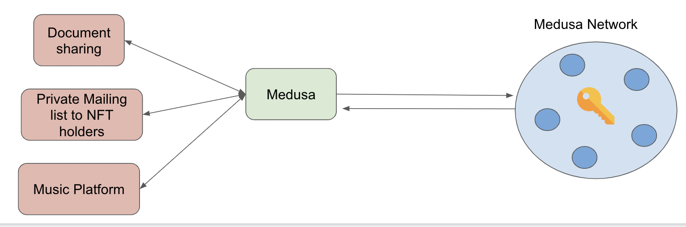

# Medusa

> *Simple programmatic access control without keys*

Medusa is a network of nodes that allows dApps to build complex access control 
systems onchain without having to manage keys!

Medusa can be used to manage access in different scenarios:
* A decentralized NFT-gated content platform
* A private content distribution platform like OnlyFans onchain
* In general, fair exchange of any private data

One can think of Medusa as similar to a price oracle. Instead of enabling onchain price feeds, Medusa
enables re-encryption / decryption of data onchain.

## An example workflow

Imagine Alice wants to sell a picture of her cat for 1 DAI on an eBay-like dApp. 

### 1. Uploading

Alice encrypts the cat picture to the Medusa network and registers the encryption and the price to the dApp platform.

### 2. Buying

When Bob wants the buy the cat picture, he sends one 1 DAI to Alice via the dApp
platform. At this point, the dApp smart contract requests Medusa to _reencrypt_ the cat picture to Bob.

### 3. Reencryption to Bob

Medusa verifies that the cat was submitted to the same platform that requested the
reencryption. If so, Medusa nodes perform their operation offchain and submit the
resulting reencryption onchain.

### 4. Local decryption

Bob sees the event that the reencryption has been submitted, and can now locally decrypt
the cat picture!

:::info Important

Only Bob can decrypt the cat picture. Medusa's [threshold encryption protocol](./about/cryptography/threshold-network.md) ensures the dApp and Medusa nodes **cannot** decrypt and see the cat picture.

:::
